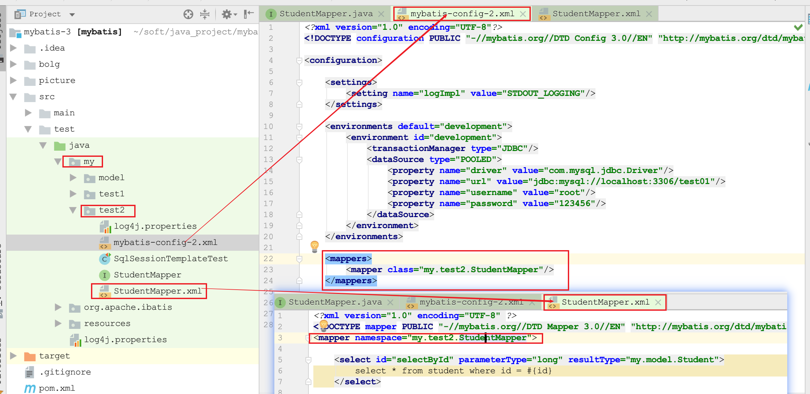

使用mybtais时，我们只需要那个定义一个mapper接口，然后在调用

```java
public void testCase1() throws Exception {
        SqlSessionManager sqlSessionManager = SqlSessionManager.newInstance(Resources.getResourceAsStream("my/test2/mybatis-config-2.xml"));
        StudentMapper studentDao = sqlSessionManager.getMapper(StudentMapper.class);
        Student stu = studentDao.selectById(1L);
        System.out.println(stu);
    }
```

就可以获得一个接口的代理对象完成需要的操作。下面主要介绍两点内容，

1. 代理的实现过程是什么?

2.  为什么使用sqlSession.getMapper的方式，需要保持mapper的xml配置文件包名和xml文件名、mapper接口文件包名和文件名、配置文件的namespace保持一致?

   

## 1. 代理实现的细节

jdk的动态代理原理，涉及Proxy、InvocationHander的等细节和介绍这里就忽略了，大家应该很熟悉，下面通过代码片段来看看mybatis中的实现细节

```java
public class SqlSessionManager implements SqlSessionFactory, SqlSession {
  ...
  private final SqlSessionFactory sqlSessionFactory;
  ...1. 
    @Override
    public <T> T getMapper(Class<T> type) {
        return getConfiguration().getMapper(type, this);
    }
  ...2.
    @Override
    public Configuration getConfiguration() {
    /**
    * 这里sqlSessionFactory就是DefaultSqlSessionFactory，一个DefaultSqlSessionFactory和一个Configuration对应，
    * Configuration就是解析xml配置文件得到一个配置类
    */
        return sqlSessionFactory.getConfiguration();
    }
}
```

由sqlSession.getMapper来到Configuration

```java
public class Configuration {
  ...
    /**
     * 一个Configuration对应一个mapperRegistry，看名字也知道它存储了Mapper的配置信息，也就是一个mapper.xml对应一个配置信息
     * private final Map<Class<?>, MapperProxyFactory<?>> knownMappers = new HashMap<>();
     * 它其实就是一个map，一个Class对应一个MapperProxyFactory，例如
     * 一个StudentMapper.class--->MapperProxyFactory<StudentMapper>
     */
    protected final MapperRegistry mapperRegistry = new MapperRegistry(this);
  ...
    public <T> T getMapper(Class<T> type, SqlSession sqlSession) {
        return mapperRegistry.getMapper(type, sqlSession);
    }
```

来到MapperRegistry

```java
public class MapperRegistry {

    private final Configuration config;
    private final Map<Class<?>, MapperProxyFactory<?>> knownMappers = new HashMap<>();
	...
    @SuppressWarnings("unchecked")
    public <T> T getMapper(Class<T> type, SqlSession sqlSession) {
        final MapperProxyFactory<T> mapperProxyFactory = (MapperProxyFactory<T>) knownMappers.get(type);
        if (mapperProxyFactory == null) {
            throw new BindingException("Type " + type + " is not known to the MapperRegistry.");
        }
        try {
          //knownMappers是在解析配置文件的时候就已经放进去的
            return mapperProxyFactory.newInstance(sqlSession);
        } catch (Exception e) {
            throw new BindingException("Error getting mapper instance. Cause: " + e, e);
        }
    }
```

来到MapperProxyFactory

```java
public class MapperProxyFactory<T> {

    private final Class<T> mapperInterface;
    private final Map<Method, MapperMethod> methodCache = new ConcurrentHashMap<>();
  ...
    @SuppressWarnings("unchecked")
    protected T newInstance(MapperProxy<T> mapperProxy) {
        return (T) Proxy.newProxyInstance(mapperInterface.getClassLoader(), new Class[]{mapperInterface}, mapperProxy);
    }

    public T newInstance(SqlSession sqlSession) {
        final MapperProxy<T> mapperProxy = new MapperProxy<>(sqlSession, mapperInterface, methodCache);
        return newInstance(mapperProxy);
    }
}
```

到这里其实已经比较明了了，Proxy的代理类代理的接口是mapperInterface，即我们定义StudentMapper接口，

InvocationHander即new MapperProxy得到的


然后重点看MapperProxy的invoke方法实现

```java
public class MapperProxy<T> implements InvocationHandler, Serializable {
	...
    private static Constructor<Lookup> lookupConstructor;
    private final SqlSession sqlSession;
    private final Class<T> mapperInterface;
    private final Map<Method, MapperMethod> methodCache;
  ...
    @Override
    public Object invoke(Object proxy, Method method, Object[] args) throws Throwable {
        try {
            //来自Object的方法，例如toString、hashCode等
            if (Object.class.equals(method.getDeclaringClass())) {
                return method.invoke(this, args);
            }
            //默认方法
            else if (method.isDefault()) {
                return invokeDefaultMethod(proxy, method, args);
            }
        } catch (Throwable t) {
            throw ExceptionUtil.unwrapThrowable(t);
        }
        //这里才是自定义方法
        final MapperMethod mapperMethod = cachedMapperMethod(method);
        return mapperMethod.execute(sqlSession, args);
    }
	...
```

当然后面的具体的mapperMethod调用方法又涉及一系列过程了：

1. 一个MapperProxy内有个MapperMethod的缓存map，即methodCache，这个使用懒加载的方式用到的时候会创建然后缓存起来，简单说就是一个mapper.xml对应一个MapperProxy，mapper.xml种定义了很多mapper子节点方法，这一个子节点方法对应一个MapperMethod

   ```java
   private MapperMethod cachedMapperMethod(Method method) {
           return methodCache.computeIfAbsent(method,
                   k -> new MapperMethod(mapperInterface, method, sqlSession.getConfiguration())
           );
       }
   ```

2. 根据MapperMethod判断这是一个select调用，然后调用sqlSession.selectOne方法，然后调用到selectList方法(可以看到selectOne其实是调用selectList，得到list后取第一条)
3. 最后经历是否使用二级缓存等判断，最底层走到sqlSession找到它所对应的一个Executor，这个Executor根据配置文件中的statementType判断创建对的一个StatementHander，默认是PreparedStatementHandler，当然一般我们也不会用到其他的，其实一个StatementHander就对应一个配置文件中的mapper节点，然后最终执行数据查询操作。


## 2. 使用getMapper方式的几个要求

三个一致的要求具体从实现上很好猜到的，例如

```java
StudentMapper studentDao = sqlSessionManager.getMapper(StudentMapper.class);
```

通过这个调用就要确定一个代理类出来，具体流程是：

1. 根据StudentMapper的类信息获取确定到StudentMapper.xml的配置文件所在，然后解析它。具体从Conguration配置文件解析开始

   ```java
   public class XMLConfigBuilder extends BaseBuilder {
   	...略
       public Configuration parse() {
            ...
               parseConfiguration(parser.evalNode("/configuration"));
               return configuration;
           }
   
   		private void parseConfiguration(XNode root) {
         ...略
           try {
              ...
               /**
                * 1. mapper配置文件开始解析
                */
               mapperElement(root.evalNode("mappers"));
           	} catch (Exception e) {
               throw new BuilderException("Error parsing SQL Mapper Configuration. Cause: " + e, e);
           	}
       	}
   //这里是几种配置方式的解析部分
      private void mapperElement(XNode parent) throws Exception {
           if (parent != null) {
               for (XNode child : parent.getChildren()) {
                   if ("package".equals(child.getName())) {
                       String mapperPackage = child.getStringAttribute("name");
                       configuration.addMappers(mapperPackage);
                   } else {
                       String resource = child.getStringAttribute("resource");
                       String url = child.getStringAttribute("url");
                       String mapperClass = child.getStringAttribute("class");
                       /**
                        * 直接写配置文件名称的方式
                        * <mapper resource="my/test1/StudentMapper.xml"/>
                        */
                       if (resource != null && url == null && mapperClass == null) {
                           ErrorContext.instance().resource(resource);
                           InputStream inputStream = Resources.getResourceAsStream(resource);
                           XMLMapperBuilder mapperParser = new XMLMapperBuilder(inputStream, configuration, resource, configuration.getSqlFragments());
                           mapperParser.parse();
                       } else if (resource == null && url != null && mapperClass == null) {
                           ErrorContext.instance().resource(url);
                           InputStream inputStream = Resources.getUrlAsStream(url);
                           XMLMapperBuilder mapperParser = new XMLMapperBuilder(inputStream, configuration, url, configuration.getSqlFragments());
                           mapperParser.parse();
                       }
                       /**
                        *  <mapper class="my.test2.StudentMapper"/> 这种方式
                        *  它和直接写配置文件名称的方式相比，多了
                        *  1. 根据mapper接口类记载配置文件；
                        *  2. 检查namespace和mapper接口类全路径名是否一致
                        *  其实是为了把这个mapper接口类和这个mapper配置文件做对应放入mapperRegistry中，为后面使用getMapper做铺垫
                        */
                       else if (resource == null && url == null && mapperClass != null) {
                           Class<?> mapperInterface = Resources.classForName(mapperClass);
                           configuration.addMapper(mapperInterface);
                       } else {
                           throw new BuilderException("A mapper element may only specify a url, resource or class, but not more than one.");
                       }
                   }
               }
           }
       }
   ```

   到MapperRegistry.addMapper

   ```java
       public <T> void addMapper(Class<T> type) {
           if (type.isInterface()) {
               if (hasMapper(type)) {
                   throw new BindingException("Type " + type + " is already known to the MapperRegistry.");
               }
               boolean loadCompleted = false;
               try {
                   knownMappers.put(type, new MapperProxyFactory<>(type));
                   // It's important that the type is added before the parser is run
                   // otherwise the binding may automatically be attempted by the
                   // mapper parser. If the type is already known, it won't try.
                   /**
                    * 这里type = my.test2.StudentMapper.class
                    */
                   MapperAnnotationBuilder parser = new MapperAnnotationBuilder(config, type);
                   parser.parse();
                   loadCompleted = true;
               } finally {
                   if (!loadCompleted) {
                       knownMappers.remove(type);
                   }
               }
           }
       }
   ```

   看parser.parse()方法

   ```java
   public void parse() {
           String resource = type.toString(); // 例如my.test2.StudentMapper
           if (!configuration.isResourceLoaded(resource)) {
               //重点在这里，这里面是配置文件的解析
               loadXmlResource();
   
               configuration.addLoadedResource(resource);
               /*
                * 这里对应 my.test2.StudentMapper
                */
               assistant.setCurrentNamespace(type.getName());
               parseCache();
               parseCacheRef();
               Method[] methods = type.getMethods();
               //这里面是method上的注解解析
               for (Method method : methods) {
                   try {
                       // issue #237
                       if (!method.isBridge()) {
                           parseStatement(method);
                       }
                   } catch (IncompleteElementException e) {
                       configuration.addIncompleteMethod(new MethodResolver(this, method));
                   }
               }
           }
           parsePendingMethods();
       }
   ```

   到loadXmlResource();

   ```java
       private void loadXmlResource() {
           // Spring may not know the real resource name so we check a flag
           // to prevent loading again a resource twice
           // this flag is set at XMLMapperBuilder#bindMapperForNamespace
           /**
            * 这里面用了两种加载方式做尝试：
            * 1. 直接在mapper接口所在目录下查找
            * 2. classpath目录下加载，所以在项目开发时为了避免接口类和配置文件混在一起，可以把
            *    配置文件放在resource目录下，但是把包名改为和接口类相同
            */
           if (!configuration.isResourceLoaded("namespace:" + type.getName())) {
               /**
                *这里把.替换成了/，最后加上.xml，确定了一个mapper.xml文件的所在
                * 例如my.test2.StudentMapper 变为 my/test2/StudentMapper.xml
                */
               String xmlResource = type.getName().replace('.', '/') + ".xml";
               // #1347
               InputStream inputStream = type.getResourceAsStream("/" + xmlResource);
               if (inputStream == null) {
                   // Search XML mapper that is not in the module but in the classpath.
                   try {
                       inputStream = Resources.getResourceAsStream(type.getClassLoader(), xmlResource);
                   } catch (IOException e2) {
                       // ignore, resource is not required
                   }
               }
               if (inputStream != null) {
                   /**
                    * 这里
                    *     public XMLMapperBuilder(InputStream inputStream, Configuration configuration, String resource, Map<String, XNode> sqlFragments, String namespace) {
                    *         this(inputStream, configuration, resource, sqlFragments);
                    *         this.builderAssistant.setCurrentNamespace(namespace);
                    *     }
                    * 注意构造函数内设置了setCurrentNamespace，即type的全路径名，由于这里设置了，所以
                    * 使用 <mapper class="my.test2.StudentMapper"/>
                    * 方式配置时，必需保证配置文件的namespace和mapper接口报名一致，否则
                    * 后面在解析时会做检查报错
                    *
                    * 当然如果使用 <mapper resource="my/test1/StudentMapper.xml"/>方式，倒是不需要
                    */
                   XMLMapperBuilder xmlParser = new XMLMapperBuilder(inputStream, assistant.getConfiguration(), xmlResource, configuration.getSqlFragments(), type.getName());
                   xmlParser.parse();
               }
           }
       }
   ```

   上面就解释了配置文件必需要mapper接口类一致原因了，不保持一致就会找不到配置文件

   看xmlParser.parse();具体的mapper节点解析

   ```java
   private void configurationElement(XNode context) {
           try {
               /**
                * 这里是从mapper配置文件中读取namespace
                */
               String namespace = context.getStringAttribute("namespace");
               if (namespace == null || namespace.equals("")) {
                   throw new BuilderException("Mapper's namespace cannot be empty");
               }
               /**
                * 这里又设置namespace，并作检查
                */
               builderAssistant.setCurrentNamespace(namespace);
               cacheRefElement(context.evalNode("cache-ref"));
               cacheElement(context.evalNode("cache"));
               parameterMapElement(context.evalNodes("/mapper/parameterMap"));
               resultMapElements(context.evalNodes("/mapper/resultMap"));
               sqlElement(context.evalNodes("/mapper/sql"));
               buildStatementFromContext(context.evalNodes("select|insert|update|delete"));
           } catch (Exception e) {
               throw new BuilderException("Error parsing Mapper XML. The XML location is '" + resource + "'. Cause: " + e, e);
           }
       }
   ```

   这里重点看buildStatementFromContext，它是一个一个节点的解析的，具体某个mapper节点的解析

   ```java
   public void parseStatementNode() {
           String id = context.getStringAttribute("id"); //例如 selectById
           String databaseId = context.getStringAttribute("databaseId"); //可以不定义，为null
   
           if (!databaseIdMatchesCurrent(id, databaseId, this.requiredDatabaseId)) {
               return;
           }
   
           String nodeName = context.getNode().getNodeName(); //mapper节点名称 例如select
           SqlCommandType sqlCommandType = SqlCommandType.valueOf(nodeName.toUpperCase(Locale.ENGLISH));
           boolean isSelect = sqlCommandType == SqlCommandType.SELECT;
           boolean flushCache = context.getBooleanAttribute("flushCache", !isSelect);
           boolean useCache = context.getBooleanAttribute("useCache", isSelect);
           boolean resultOrdered = context.getBooleanAttribute("resultOrdered", false);
   
           // Include Fragments before parsing
           XMLIncludeTransformer includeParser = new XMLIncludeTransformer(configuration, builderAssistant);
           includeParser.applyIncludes(context.getNode());
   
           String parameterType = context.getStringAttribute("parameterType");
           Class<?> parameterTypeClass = resolveClass(parameterType);
   
           String lang = context.getStringAttribute("lang");
           LanguageDriver langDriver = getLanguageDriver(lang);
   
           // Parse selectKey after includes and remove them.
           processSelectKeyNodes(id, parameterTypeClass, langDriver);
   
           // Parse the SQL (pre: <selectKey> and <include> were parsed and removed)
           KeyGenerator keyGenerator;
           String keyStatementId = id + SelectKeyGenerator.SELECT_KEY_SUFFIX; //例如 selectById!selectKey
           /**
            * 这里 namespace会用到mapper的定位上
            * keyStatementId =  currentNamespace + "." + base;
            */
           keyStatementId = builderAssistant.applyCurrentNamespace(keyStatementId, true);
           if (configuration.hasKeyGenerator(keyStatementId)) {
               keyGenerator = configuration.getKeyGenerator(keyStatementId);
           } else {
               keyGenerator = context.getBooleanAttribute("useGeneratedKeys",
                       configuration.isUseGeneratedKeys() && SqlCommandType.INSERT.equals(sqlCommandType))
                       ? Jdbc3KeyGenerator.INSTANCE : NoKeyGenerator.INSTANCE;
           }
   
           SqlSource sqlSource = langDriver.createSqlSource(configuration, context, parameterTypeClass); //sqlSource记录了这个sql的详细信息，包括sql语句，以及参数等
           StatementType statementType = StatementType.valueOf(context.getStringAttribute("statementType", StatementType.PREPARED.toString()));
           Integer fetchSize = context.getIntAttribute("fetchSize");
           Integer timeout = context.getIntAttribute("timeout");
           String parameterMap = context.getStringAttribute("parameterMap");
           String resultType = context.getStringAttribute("resultType");
           Class<?> resultTypeClass = resolveClass(resultType);
           String resultMap = context.getStringAttribute("resultMap");
           String resultSetType = context.getStringAttribute("resultSetType");
           ResultSetType resultSetTypeEnum = resolveResultSetType(resultSetType);
           if (resultSetTypeEnum == null) {
               resultSetTypeEnum = configuration.getDefaultResultSetType();
           }
           String keyProperty = context.getStringAttribute("keyProperty");
           String keyColumn = context.getStringAttribute("keyColumn");
           String resultSets = context.getStringAttribute("resultSets");
   
           builderAssistant.addMappedStatement(id, sqlSource, statementType, sqlCommandType,
                   fetchSize, timeout, parameterMap, parameterTypeClass, resultMap, resultTypeClass,
                   resultSetTypeEnum, flushCache, useCache, resultOrdered,
                   keyGenerator, keyProperty, keyColumn, databaseId, langDriver, resultSets);
       }
   ```

   比较繁琐，重点看这个namespace的用处，它是和一个mapper的id一起来组成这个mapper的唯一定位，具体在

   ```java
   public String applyCurrentNamespace(String base, boolean isReference) {
    ...略
           return currentNamespace + "." + base;
       }
   ```

   这个后面在生成MappedStatement的时候还会用到。

   这里关于mapper的加载做个小结：

   1. mybatis 提供了四种mapper文件加载方式：1. package扫描；2. 指定.xml文件；3. 指定url; 4. 指定class

      其中1和4可以看作方法一，2和3可以看作方法二。使用方法一会在configuration的mapperRegisty中注册Class与MapperProxyFactory的一一对应关系，注册过程中会检查xml配置文件中namespace与Class的报名的相同性，所以需要保持上面提到的三个一致，为后面使用sqlSession.getMapper方式获取代理做准备；方式二不要求xml中namespace和Class的报名保持一致，但是使用这种方式你就不能用sqlSession.getMapper来获取代理类了

      