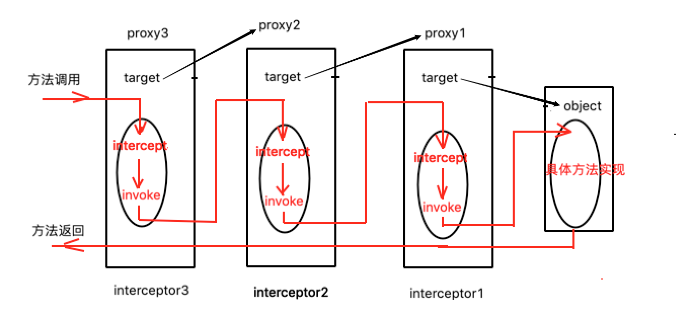
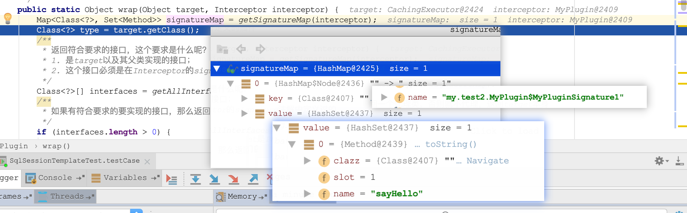

这个应该用一张图就能直观看明白mybatis的插件机制



图画的比较粗糙，假如我们顺序定义了三个插件interceptor1、interceptor2、interceptor3，最原始的object是一个Executor，这个体现在代码

```java
public Executor newExecutor(Transaction transaction, ExecutorType executorType) {
       ...略
        executor = (Executor) interceptorChain.pluginAll(executor);
        return executor; //1. 
}
```

再假如三个插件的Signature注解描述的都是Executor的query方法方法

```java
@Intercepts(@Signature(
  type = Executor.class, 
  method = "query", 
  args = {MappedStatement.class, Object.class, RowBounds.class, ResultHandler.class}
))
public class Plugin1 implements Interceptor {
  ...
      public Object intercept(Invocation invocation) throws Throwable {...}
  ...
}
```

那么经过 

```java
executor = (Executor) interceptorChain.pluginAll(executor);
```

这个executor得最终对象是上图中的proxy3，proxy代理了prox2，proxy2代理了proxy1，proxy1是最初的那个executor代理，图中object即为最初的那个executor；mybatis正是用这种层层代理的方式实现了一种链式结果。

假如我们调用了executor.query方法，那么其实调用的是proxy3的query方法，在调用query方法前会调用调用interceptor3的intercep方法，你可以在intercept方法中做你想做的事情，这里就达到了代理的作用；在intercept中需要最后调用

```java
Object res = invocation.proceed();
```

将这个链式调用传递下去；然后同样的原理方法调用走到了proxy2中，最终走到object中，最终结果将会原路返回给调用者。基本原理就是这样了，下面将通过代码细节来说明。

1. mybatis中只有四个对象可以被插件拦截，分别是ParameterHandler、ResultSetHandler、StatementHandler和Executor

   Configuration中定义了一个InterceptorChain的对象，它存放了我们自定义的一系列插件

   ```java
   public class InterceptorChain {
   
       private final List<Interceptor> interceptors = new ArrayList<>();
   
       public Object pluginAll(Object target) {
           for (Interceptor interceptor : interceptors) {
               target = interceptor.plugin(target);
           }
           return target;
       }
   
       public void addInterceptor(Interceptor interceptor) {
           interceptors.add(interceptor);
       }
   
       public List<Interceptor> getInterceptors() {
           return Collections.unmodifiableList(interceptors);
       }
   }
   ```

   可以看到会被拦截的对象target会执行pluginAll方法，在mybatis的源码中，只有四个地方执行了pluginAll方法，具体在Configuration类中

   ```java
   parameterHandler = (ParameterHandler) interceptorChain.pluginAll(parameterHandler);
   resultSetHandler = (ResultSetHandler) interceptorChain.pluginAll(resultSetHandler);
   statementHandler = (StatementHandler) interceptorChain.pluginAll(statementHandler);
   executor = (Executor) interceptorChain.pluginAll(executor);
   ```

   所以只有这四个接口类会被插件拦截

2. 执行interceptor.plugin(target)，会返回target的一个代理对象

   ```java
   public interface Interceptor {
       Object intercept(Invocation invocation) throws Throwable;
     	//这是一个默认实现，我们不用动
       default Object plugin(Object target) {
           return Plugin.wrap(target, this);
       }
   
       default void setProperties(Properties properties) {
           // NOP
       }
   }
   ```

   ```java
      /**
        * @param target      这里target是ParameterHandler、ResultSetHandler、StatementHandler、Executor
        * @param interceptor 这个是我们自定义的插件
        */
       public static Object wrap(Object target, Interceptor interceptor) {
           Map<Class<?>, Set<Method>> signatureMap = getSignatureMap(interceptor);
           Class<?> type = target.getClass();
           /**
            * 返回符合要求的接口，这个要求是什么呢？
            * 1. 是target以及其父类实现的接口；
            * 2. 这个接口必须是在Interceptor的signature注解中定义过的
            */
           Class<?>[] interfaces = getAllInterfaces(type, signatureMap);
           /**
            * 如果有符合要求的要实现的接口，那么返回一个代理类，否则就不代理，返回target本身
            */
           if (interfaces.length > 0) {
               return Proxy.newProxyInstance(
                       type.getClassLoader(),
                       interfaces,
                       new Plugin(target, interceptor, signatureMap)
               );
           }
           return target;
       }
   ```

   wrap方法会返回一个代理或者其自身。signatureMap存储了interceptor中@Signature注解描述的会被拦截的某个对象的某个方法，比如我们上面定义的

   ```java
   @Intercepts(@Signature(
     type = Executor.class, 
     method = "query", 
     args = {MappedStatement.class, Object.class, RowBounds.class, ResultHandler.class}
   ))
   public class Plugin1 implements Interceptor {
     ...
         public Object intercept(Invocation invocation) throws Throwable {...}
     ...
   }
   ```

   这个@Signature意思其实是如果某个Executor执行了一个参数是args的query方法，将会被Plugin1拦截到。

   ```java
   Class<?>[] interfaces = getAllInterfaces(type, signatureMap);
   ```

   这个interfaces返回的是@Signature中定义过的type的接口以及其所有父接口，如果定义了，那么返回一个代理，没有就不代理了。这里思考，如果我定义了一个这样的一个插件

   ```java
   @Intercepts(value = {
           @Signature(type = MyPlugin.MyPluginSignature1.class, method = "sayHello", args = String.class)
   })
   public class MyPlugin implements Interceptor {
     ...
   }
   
   class MyPluginSignature1 {
     public String sayHello(String something) {
       System.out.println("---- hello1 ----");
       return something;
     }
   }
   ```

   这个插件有用吗？其实它没用的。这样一个插件它的signatureMap为

   

   它的key是MyPlugin.MyPluginSignature1，上面说过能被拦截只有那四个接口，他们是没有交集的，所以getAllInterfaces方法返回的interfaces是空的，将不会生成关于这个插件的代理。

   ```java
   /**
        * 返回interceptor这个插件定义的所有的所有Method
        * 一个interceptor可以定义多个Signature，一个Signature可以定义多个类方法
        */
   private static Map<Class<?>, Set<Method>> getSignatureMap(Interceptor interceptor) {
     /**
            * 1 必须注解 @Intercepts，且@Intercepts必须设置value属性
            */
     Intercepts interceptsAnnotation = interceptor.getClass().getAnnotation(Intercepts.class);
     // issue #251
     if (interceptsAnnotation == null) {
       throw new PluginException("No @Intercepts annotation was found in interceptor " + interceptor.getClass().getName());
     }
     /**
            * 2. 可以配置多个@Signature，每个@Signature必须设置value属性，value属性包括
            *     Class<?> type();
            *     String method();
            *     Class<?>[] args();
            *    根据下面的for循环可以看出，这三个属性的意思是，Class类型是type 参数是args 方法名是method的那个Method会被加入到signatureMap中
            *    key是type的那个Class,value是这个method组成的Set
            */
     Signature[] sigs = interceptsAnnotation.value();
     Map<Class<?>, Set<Method>> signatureMap = new HashMap<>();
     for (Signature sig : sigs) {
       Set<Method> methods = signatureMap.computeIfAbsent(sig.type(), k -> new HashSet<>());
       try {
         Method method = sig.type().getMethod(sig.method(), sig.args());
         methods.add(method);
       } catch (NoSuchMethodException e) {
         throw new PluginException("Could not find method on " + sig.type() + " named " + sig.method() + ". Cause: " + e, e);
       }
     }
     return signatureMap;
   }
   ```

   ```java
   private static Class<?>[] getAllInterfaces(Class<?> type, Map<Class<?>, Set<Method>> signatureMap) {
     Set<Class<?>> interfaces = new HashSet<>();
     while (type != null) {
       for (Class<?> c : type.getInterfaces()) {
         if (signatureMap.containsKey(c)) {
           interfaces.add(c);
         }
       }
       type = type.getSuperclass();
     }
     return interfaces.toArray(new Class<?>[interfaces.size()]);
   }
   ```

   这样3个插件就调用了三次plugin方法，原始的Executor就被包装了三层，每一层的target为前一个interceptor代理Proxy对象。再看代理的InvocationHander，即Plugin

   ```java
   @Override
   public Object invoke(Object proxy, Method method, Object[] args) throws Throwable {
     try {
       Set<Method> methods = signatureMap.get(method.getDeclaringClass());
       /**
                * 如果target要执行的那个方法(method)是Signature中定义过的，那么做拦截
                * --
                * 其实这里 (1)return interceptor.intercept(new Invocation(target, method, args));
                * 也是做了一个层层代理，你会发现它最终都是调用的也是 (2)method.invoke(target, args);
                * 但是(1)它多执行了一步intercept，这个地方做了个步骤就做了所谓的拦截，在拦截前后你可以做些自定义的动作
                * 其实这个interceptor也就在这个地方有些实际的用途了，其他地方你会发现interceptor只是来回的做传递或者获取它的一些属性而已
                * --
                * 其实这个地方可以改写成下面，原理是这样，但是这样就没有扩展性了，为了扩展性才给interceptor定义了intercept方法，
                * 还把(target, method, args)封住成一个Invocation对象
                *
                *  if (method != null && methods.contains(method)) {
                *      //do something before
                *        Object res = method.invoke(target, args);
                *      //do something after
                *        return res;
                *  } else {
                *        return method.invoke(target, args);
                *  }
                *
                */
       if (methods != null && methods.contains(method)) {
         return interceptor.intercept(new Invocation(target, method, args));
       }
       return method.invoke(target, args);
     } catch (Exception e) {
       throw ExceptionUtil.unwrapThrowable(e);
     }
   }
   ```

   代码注释做了很详细的解释，简单的说就是插件的@Signature中定义的方法才会被拦截执行intercep，没有被定义的会被忽略。

   这里写了一个Demo，插件拦截ParameterHandler的getParameterObject、setParameters方法，StatementHandler的prepare方法

   ```java
   @Intercepts(value = {
           @Signature(type = MyPlugin.MyPluginSignature1.class, method = "sayHello", args = String.class),
           //ParameterHandler
           @Signature(type = ParameterHandler.class, method = "getParameterObject", args = {}),
           @Signature(type = ParameterHandler.class, method = "setParameters", args = {PreparedStatement.class}),
           //StatementHandler
           @Signature(type = StatementHandler.class, method = "prepare", args = {Connection.class, Integer.class})
   })
   public class MyPlugin implements Interceptor {
   
       private Properties properties = null;
   
       @Override
       public Object intercept(Invocation invocation) throws Throwable {
           System.out.println("--before--");
           System.out.println(invocation.getTarget().getClass().getName());
           System.out.println(invocation.getMethod().getName());
           System.out.println(invocation.getArgs().getClass().getName());
   
           Object res = invocation.proceed();
   
           System.out.println("--after. res = " + res);
   
           return res;
       }
   
       @Override
       public void setProperties(Properties properties) {
           this.properties = properties;
       }
   
       /**
        * signature 1
        * 这个signature因为没有实现的ParameterHandler、ResultSetHandler、StatementHandler、Executor等任何一个接口，其实没啥用
        */
       class MyPluginSignature1 {
           public String sayHello(String something) {
               System.out.println("---- hello1 ----");
               return something;
           }
       }
   }
   
   ```

   效果为：

   ```xml
   --before--
   org.apache.ibatis.executor.statement.RoutingStatementHandler
   prepare
   [Ljava.lang.Object;
   --after. res = com.mysql.cj.jdbc.PreparedStatement@7c137fd5: select * from student
   --before--
   org.apache.ibatis.scripting.defaults.DefaultParameterHandler
   setParameters
   [Ljava.lang.Object;
   --after. res = null
   ```

   其他的插件我没有找到很多，似乎很多人喜欢用PageHelper[这样一个分页插件](https://gitee.com/free/Mybatis_PageHelper)，我们项目中并没有用这个组件。其实我不太明白，分页不就是设置好参数offset和count就可以了吗，为什么还要引入这样一个东西呢，它究竟有多少优点呢。大致看了一下它的代码

   ```java
   @Intercepts(@Signature(type = Executor.class, method = "query", args = {MappedStatement.class, Object.class, RowBounds.class, ResultHandler.class}))
   public class PageHelper implements Interceptor {
     ...
   }
   ```

   它在Executor执行query方法时做拦截，具体最后是在sql语句后面加上了limt offset,count，非常细致的细节我没有看，看效果

   ```java
   @Test
   public void testCase() throws Exception {
     SqlSessionManager sqlSessionManager = SqlSessionManager.newInstance(Resources.getResourceAsStream("my/test2/mybatis-config-2.xml"));
     StudentMapper studentDao = sqlSessionManager.getMapper(StudentMapper.class);
     PageHelper.startPage(1, 10);
     List<Student> list = studentDao.selectWithPage(1);
   }
   ```

   ```sql
   <mapper namespace="my.test2.StudentMapper">
       <select id="selectWithPage" parameterType="int" resultType="my.model.Student">
           select * from student
       </select>
   </mapper>
   ```

   ```java
   Setting autocommit to false on JDBC Connection [com.mysql.cj.jdbc.ConnectionImpl@5745ca0e]
   ==>  Preparing: SELECT count(0) FROM student 
   ==> Parameters: 
   <==    Columns: count(0)
   <==        Row: 2
   <==      Total: 1
   ==>  Preparing: select * from student limit ?,? 
   ==> Parameters: 0(Integer), 10(Integer)
   <==    Columns: id, num, name
   <==        Row: 1, 10, 2
   <==        Row: 2, 11, 2
   <==      Total: 2
   ```

   眼拙没看出它有多方便


至此插件机制的原理结束，又是一个代理的很巧妙的应用，这需要对jdk动态代理很熟悉的理解

