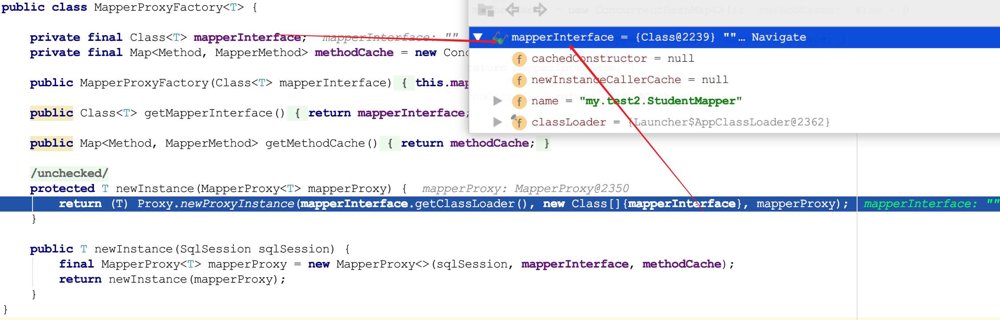

使用mybtais时，我们只需要那个定义一个mapper接口，然后在调用

```java
public void testCase1() throws Exception {
        SqlSessionManager sqlSessionManager = SqlSessionManager.newInstance(Resources.getResourceAsStream("my/test2/mybatis-config-2.xml"));
        StudentMapper studentDao = sqlSessionManager.getMapper(StudentMapper.class);
        Student stu = studentDao.selectById(1L);
        System.out.println(stu);
    }
```

就可以获得一个接口的代理对象完成需要的操作。下面主要介绍两点内容，1. 代理的实现过程是什么； 2. 为什么使用mapper代理的方式，需要保持mapper配置文件包名、mapper接口包名、配置文件的namespace三者保持一致。

## 1. 代理实现的细节

jdk的动态代理原理，涉及Proxy、InvocationHander的实现细节这里就忽略了，大家应该很熟悉，下面通过代码片段来看看细节

```java
public class SqlSessionManager implements SqlSessionFactory, SqlSession {
  ...
  private final SqlSessionFactory sqlSessionFactory;
  ...1. 
    @Override
    public <T> T getMapper(Class<T> type) {
        return getConfiguration().getMapper(type, this);
    }
  ...2.
    @Override
    public Configuration getConfiguration() {
    /**
    * 这里sqlSessionFactory就是DefaultSqlSessionFactory，一个DefaultSqlSessionFactory和一个Configuration对应，
    * Configuration就是解析xml配置文件得到一个配置类
    */
        return sqlSessionFactory.getConfiguration();
    }
}
```

由sqlSession.getMapper来到Configuration

```java
public class Configuration {
  ...
    /**
     * 一个Configuration对应一个mapperRegistry，看名字也知道它存储了Mapper的配置信息，也就是一个mapper.xml对应一个配置信息
     * private final Map<Class<?>, MapperProxyFactory<?>> knownMappers = new HashMap<>();
     * 它其实就是一个map，一个Class对应一个MapperProxyFactory，例如
     * 一个StudentMapper.class--->MapperProxyFactory<StudentMapper>
     */
    protected final MapperRegistry mapperRegistry = new MapperRegistry(this);
  ...
    public <T> T getMapper(Class<T> type, SqlSession sqlSession) {
        return mapperRegistry.getMapper(type, sqlSession);
    }
```

来到MapperRegistry

```java
public class MapperRegistry {

    private final Configuration config;
    private final Map<Class<?>, MapperProxyFactory<?>> knownMappers = new HashMap<>();
	...
    @SuppressWarnings("unchecked")
    public <T> T getMapper(Class<T> type, SqlSession sqlSession) {
        final MapperProxyFactory<T> mapperProxyFactory = (MapperProxyFactory<T>) knownMappers.get(type);
        if (mapperProxyFactory == null) {
            throw new BindingException("Type " + type + " is not known to the MapperRegistry.");
        }
        try {
          //knownMappers是在解析配置文件的时候就已经放进去的
            return mapperProxyFactory.newInstance(sqlSession);
        } catch (Exception e) {
            throw new BindingException("Error getting mapper instance. Cause: " + e, e);
        }
    }
```

来到MapperProxyFactory

```java
public class MapperProxyFactory<T> {

    private final Class<T> mapperInterface;
    private final Map<Method, MapperMethod> methodCache = new ConcurrentHashMap<>();
  ...
    @SuppressWarnings("unchecked")
    protected T newInstance(MapperProxy<T> mapperProxy) {
        return (T) Proxy.newProxyInstance(mapperInterface.getClassLoader(), new Class[]{mapperInterface}, mapperProxy);
    }

    public T newInstance(SqlSession sqlSession) {
        final MapperProxy<T> mapperProxy = new MapperProxy<>(sqlSession, mapperInterface, methodCache);
        return newInstance(mapperProxy);
    }
}
```

到这里其实已经比较明了了，Proxy的代理类代理的接口是mapperInterface，即我们定义StudentMapper接口，

InvocationHander即new MapperProxy得到的



然后重点看MapperProxy的invoke方法实现

```java
public class MapperProxy<T> implements InvocationHandler, Serializable {
	...
    private static Constructor<Lookup> lookupConstructor;
    private final SqlSession sqlSession;
    private final Class<T> mapperInterface;
    private final Map<Method, MapperMethod> methodCache;
  ...
    @Override
    public Object invoke(Object proxy, Method method, Object[] args) throws Throwable {
        try {
            //来自Object的方法，例如toString、hashCode等
            if (Object.class.equals(method.getDeclaringClass())) {
                return method.invoke(this, args);
            }
            //默认方法
            else if (method.isDefault()) {
                return invokeDefaultMethod(proxy, method, args);
            }
        } catch (Throwable t) {
            throw ExceptionUtil.unwrapThrowable(t);
        }
        //这里才是自定义方法
        final MapperMethod mapperMethod = cachedMapperMethod(method);
        return mapperMethod.execute(sqlSession, args);
    }
	...
```

当然后面的具体的mapperMethod调用方法又涉及一系列过程了：

1. 一个MapperProxy内有个MapperMethod的缓存map，即methodCache，这个使用懒加载的方式用到的时候会创建然后缓存起来，简单说就是一个mapper.xml对应一个MapperProxy，mapper.xml种定义了很多mapper子节点方法，这一个子节点方法对应一个MapperMethod

   ```java
   private MapperMethod cachedMapperMethod(Method method) {
           return methodCache.computeIfAbsent(method,
                   k -> new MapperMethod(mapperInterface, method, sqlSession.getConfiguration())
           );
       }
   ```

2. 根据MapperMethod判断这是一个select调用，然后调用sqlSession.selectOne方法，然后调用到selectList方法(可以看到selectOne其实是调用selectList然后取第一条)
3. 最后经历是否使用二级缓存等判断，最底层走到sqlSession找到它所对应的一个Executor，这个Executor根据配置文件中的statementType判断创建对的一个StatementHander，默认是PreparedStatementHandler，当然一般我们也不会用到其他的，其实一个StatementHander就对应一个配置文件中的mapper节点，然后最终执行数据查询操作。


